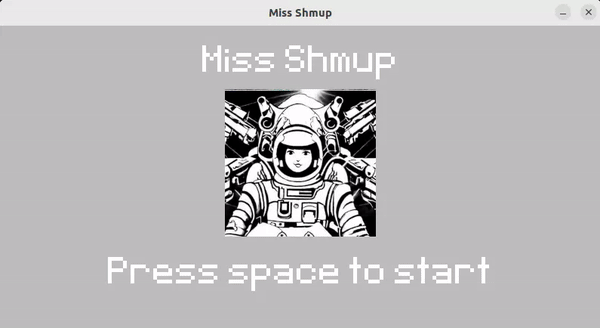
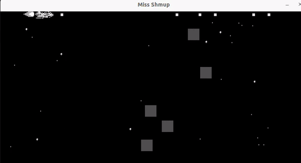
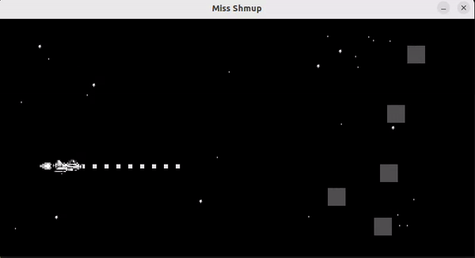
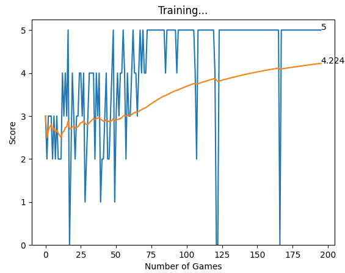
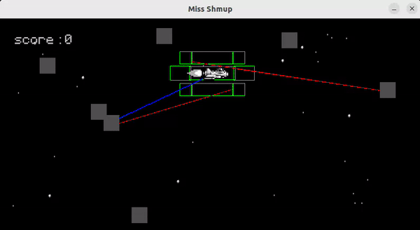
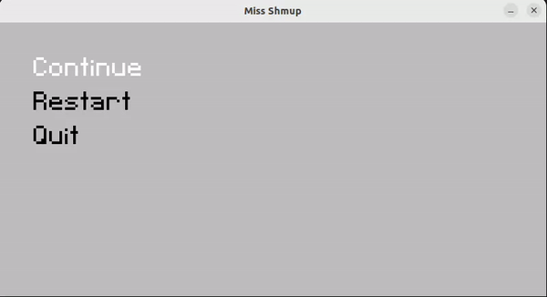

# Miss-Shmup-AI

Please note that this project is still a work in progress.

## Presentation

"Miss Shmup AI" is both a shooting game and a lightweight deep learning model capable of real-time gameplay on a basic CPU. It started as a Python practice project using Pygame and evolved into an exploration of machine learning principles and PyTorch.

## First Steps

By providing basic information to the agent (such as the number of enemies above, below, and in the line of fire), the model learns to shoot more accurately through reinforcement learning:

Acting randomly at first:

It improves after approximately 100 games:

Watching the neural network learn is a rewarding experience. It's reminiscent of working with special effects simulations. Initially, you set up (hyper-)parameters and observe them evolve, hoping for the desired outcome. Although this particular result may be prone to overfitting and achievable through conventional coding, the machine learning approach adds a unique satisfying dimension.

## Avoiding Collisions

Next, I aimed to implement a dodging mechanism. Struggling to devise a lightweight, self-learning approach, I began by coding it without deep learning to understand what relevant information the agent required.

By computing the level of danger for all potential directions the agent could take (represented as green rectangles in the video below) and moving in the opposite direction, I achieved satisfactory results.

Now, I can reward the agent for moving in the direction of less danger AND for eliminating enemies. 
Admittedly, there's a considerable amount of hand-holding in this toy model, and the addition of machine learning doesn't provide significant benefits yet. Nonetheless, it was an excellent learning experience, and the model functions to some extent:

To be continued... Maybe.
